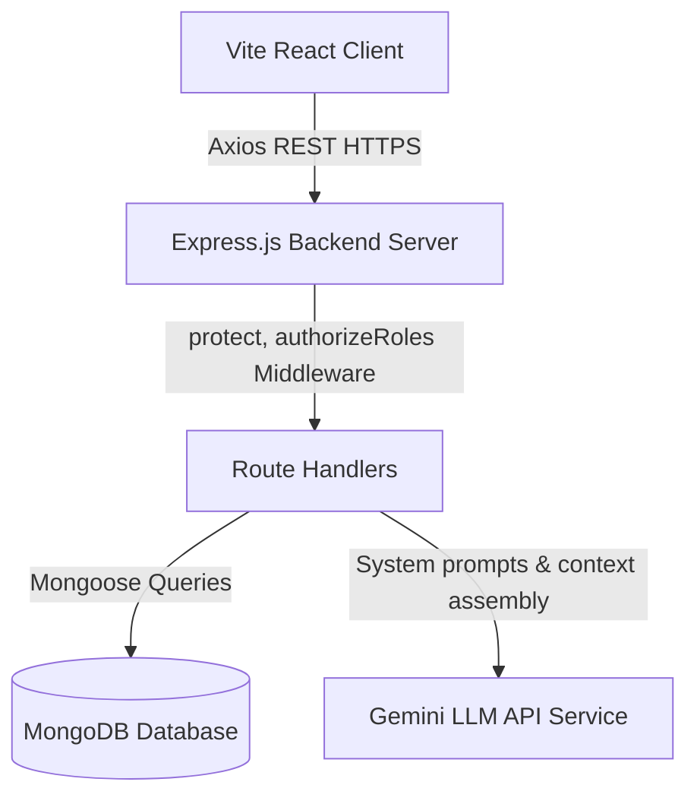
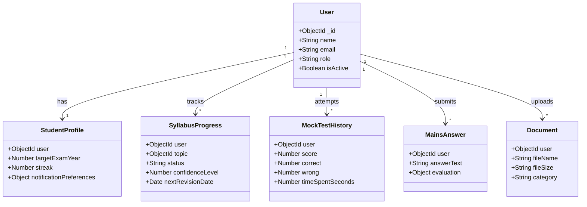

# UPSC PrepPilot

AI-Powered UPSC Preparation & Performance Management Platform

UPSC PrepPilot is a premium, full-stack SaaS platform designed for UPSC Civil Services Examination (CSE) aspirants to streamline, verify, and accelerate their preparation journey using spaced-repetition tracking, custom exam audit centers, and advisory AI-based evaluations.

---

## Problem Statement

UPSC Civil Services Examination is one of the most competitive tests globally, requiring vast syllabus coverage spanning multiple disciplines (Polity, History, Economics, Ethics, Geography). Aspirants face several critical challenges:
1. **Unstructured Trackers**: Tracking syllabus sub-topics across three stages (Prelims, Mains, Interview) is highly fragmented.
2. **Review Deficits & Decay**: Memory recall curves demand structured spaced repetition, which is rarely managed systematically.
3. **Mains Feedback Gap**: Standard tests do not provide immediate feedback on structure, examples, and committee recommendations for Mains answer scripts.
4. **Disorganized Error Analysis**: Aspirants repeat similar mistakes in MCQ practices without logging conceptual, factual, or misreading errors.

---

## Solution

PrepPilot consolidates these preparation pillars into an integrated, interactive system:
- **Command Deck & Audit Center**: Evaluates overall readiness via a transparent weighted Preparation Score (30% Syllabus, 30% Mocks, 20% Mains, 20% Revisions).
- **Spaced-Repetition Engine**: Automatically schedules future revisions (Day 1, 3, 7, 30) based on student confidence ratings.
- **RAG-ready Material Vault**: Enables aspirants to upload notes/PDFs and query them directly using context-grounded document assistants.
- **Mains Grading Engine**: Evaluates introduced lines, body contents, facts/data, committee recommendations, and word counts under advisory examiner guidelines.

---

## Features

### 📊 1. Command Deck & Platform Analytics
- Comprehensive performance trackers monitoring focus sessions, study streaks, and mock test scores.
- Recharts-based MCQ option distributions and study consistency graphs.

### 📋 2. UPSC Syllabus Tracker
- Collapsible syllabus indexes grouped by GS Papers and CSAT.
- Slider-based confidence logging (1-5), revision schedule triggers, and syllabus completion rates.

### 🎯 3. Practice & Mock Test Room
- Custom mock generators supporting topic-based, subject-based, and mixed practice configurations.
- Stopwatch countdown timers, question palettes, mark for review indicators, and qualification benchmark audits.

### 📕 4. Mistake Book
- Automatic logging of incorrect MCQ practice submissions.
- Error categorizations (Conceptual, Careless, Misreading) with personal notes and resolution checkmarks.

### 🔁 5. Spaced-Repetition Revision Room
- Automated dashboards sorting revision queues into Due Today, Overdue, and Upcoming sections.
- Integrated flip recall flashcards and ratings tracker.

### 🤖 6. AI Personal Mentor
- Context-aware chatbot utilizing candidate profile variables (syllabus rate, mistake counts, test accuracy) to generate customized preparation feedback.

### ✍️ 7. Mains Answer Writing Console
- Minimalist text workspace with word counts, target constraints, and stopwatch timers.
- Advisory evaluation outlines checking Introduction, Body Depth, Committee recommendations, and Presentation.

### 📁 8. Study Material Vault (RAG-Ready)
- Document upload library supporting PDF, TXT, and Word formats.
- Context-grounded Document Assistant displaying summaries, chapter breakdowns, fact finders, and Hindi explanations.

### ⏱️ 9. Zen Focus Chamber
- Pomodoro style deep study countdown clocks (25, 50, 90 mins, custom) linking directly to syllabus topics and task checklists.

### 🔔 10. Alert Center
- Centralized notification lists with category-level preferences toggles to avoid user spamming.

### ⚙️ 11. Admin Command Deck
- Secure student account logs, active status switches, role overrides (Student vs Admin), and content manager lists.

---

## Tech Stack

- **Frontend**: React.js (v18), Vite, Bootstrap 5, Recharts, React Router v6, Axios
- **Backend**: Node.js, Express.js (v4)
- **Database**: MongoDB (Mongoose ODM)
- **Authentication**: JSON Web Tokens (JWT), bcryptjs
- **Security**: Helmet headers, CORS policies, Express-rate-limit, Custom Mongo-Sanitize injections middleware

---

## Architecture



---

## Database Schema



---

## API Endpoints

### 🔐 Authentication
- `POST /api/auth/register` - Create student account.
- `POST /api/auth/login` - Validate credentials and return JWT.
- `GET /api/auth/profile` - Retrieve active user profile data.

### 📋 Syllabus
- `GET /api/syllabus` - Fetch syllabus topics.
- `PUT /api/syllabus/progress` - Update status, confidence, and revision timings.

### 🎯 Practice & Mocks
- `GET /api/practice/questions` - Retrieve MCQs/PYQs with subject filters.
- `POST /api/practice/questions/submit` - Grade MCQ submission and log errors to Mistake Book.

### 🔁 Spaced-Repetition Revisions
- `GET /api/analytics/complete` - Compute weighted Readiness Score and active topic metrics.

### 📁 Document Vault
- `GET /api/documents` - Fetch user's study materials.
- `POST /api/documents` - Upload and index document metadata.
- `POST /api/documents/:id/assistant` - grounded document-specific Q&A chat.

### ⚙️ Administration
- `GET /api/admin/overview` - Fetch platform usage stats (Admin Only).
- `PUT /api/admin/users/:id/status` - Toggle user active status (Admin Only).

---

## Installation

### Prerequisites
- Node.js (v18+)
- MongoDB Community Server (Running on localhost or MongoDB Atlas URI)

### Setup Steps
1. **Clone the Repository**
2. **Install Backend Dependencies**
   ```bash
   cd server
   npm install
   ```
3. **Install Frontend Dependencies**
   ```bash
   cd ../client
   npm install
   ```
4. **Seed Database (Syllabus & Mock Questions)**
   ```bash
   cd ../server
   npm run seed
   ```

---

## Environment Variables

Create a `.env` file in the `server` directory:
```env
PORT=5099
MONGODB_URI=mongodb://127.0.0.1:27017/preppilot
JWT_SECRET=your_jwt_secret_key_string
JWT_EXPIRES_IN=7d
NODE_ENV=development

# AI LLM Settings
AI_PROVIDER=mock  # Set to "gemini" if GEMINI_API_KEY is active
GEMINI_API_KEY=your_gemini_api_key_goes_here
```

---

## Running Locally

### Start Backend Dev Server
```bash
cd server
npm run dev
```
*(Server runs on port 5099)*

### Start Frontend Client
```bash
cd client
npm run dev
```
*(Client runs on port 5173)*

### Run Automated API Verification Tests
```bash
cd server
npm run test
```

---

## AI Setup & Configuration
- By default, PrepPilot operates in **Offline Fallback Mock Mode** if no Gemini key is provided, ensuring all features are fully functional out-of-the-box.
- To enable live AI evaluations, provide a valid Google Gemini API Key in the `GEMINI_API_KEY` variable and set `AI_PROVIDER=gemini`.

---

## Deployment Guidelines

### Frontend
- Compile production assets using `npm run build` inside `client`.
- Serve the static `dist/` directory folder on Vercel, Netlify, or AWS S3.

### Backend
- Serve the Node.js application on Render, Heroku, or AWS EC2 instances.
- Ensure the production environment has `NODE_ENV=production` set to disable stack trace leaks and enforce secure cookies.

### Database
- Deploy Mongo instance on MongoDB Atlas and update connection strings in environment variables.

---

## Security Implementation
- **MongoDB Query Sanitizer**: Custom regex middleware scrubs prefix operators (`$`, `.`) from request objects.
- **Admin Access Checks**: Multi-tier role authorizations verified at backend route controllers.
- **Express Protection**: Helmet security headers block frame-sniffing, while rate-limiters protect auth routes.

---

## Future Improvements
- **Mobile Application**: Construct React Native app mirroring Command Deck.
- **Mentor Dashboard**: Interface for official teachers to audit student Mistake Books and syllabus tracks.
- **Advanced RAG**: Full semantic chunks search integration using vector databases.
- **Multilingual Support**: Switch syllabus checklists and MCQ explanations between English and Hindi.

---

## Advisory Disclaimer
PrepPilot AI Personal Mentor reviews and Mains evaluations are advisory tools designed for preparation guidance. Feedback, scores, and schedules are not equivalent to official Union Public Service Commission (UPSC) criteria and should be cross-referenced with authoritative syllabus notifications and standard academic textbooks.
